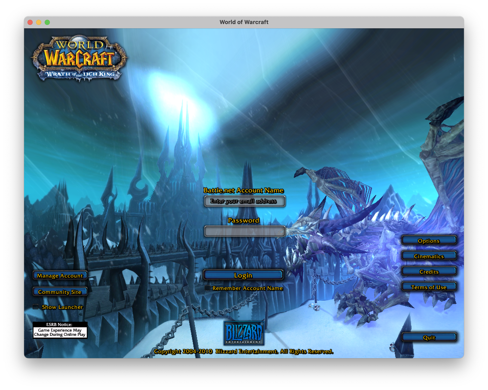

# Whoa

Welcome to Whoa, an unofficial open source implementation of the World of Warcraft 3.3.5a (build 12340) game client in C++11.

## Supported Platforms

Currently, macOS 10.14+ is supported, including recent versions of macOS on M1 processors. Support for Windows and Linux is in progress.

## Building

To build, ensure you have installed a recent version of CMake and an appropriate C++ build environment, and run the following from the `whoa` directory:

```
mkdir build && cd build
cmake ..
make install
```

Assuming all went well, you should see a `dist/bin` directory appear in the `build` directory. The `dist/bin` directory will contain a `Whoa` executable.

## Running

Whoa doesn't currently support reading from MPQ archives. Instead, it assumes you are launching the Whoa executable from the root of a fully extracted MPQ archive set for World of Warcraft 3.3.5a (build 12340). You can obtain a valid set of MPQ archives to extract by installing World of Warcraft 3.3.5a from legally purchased original install media. Whoa does not provide any copy of game data.

Assuming all goes well, you should be greeted by the login screen, complete with its flying dragon animation loop.

Whoa is very much a work-in-progress: it does not fully connect to a login server, does not play back sound or music, and does not support customizing settings. These things will be supported over time.



## Contributing

Thanks for making a contribution to Whoa!

Since Whoa is a faithful implementation of the original 3.3.5a (build 12340) client, there are some important considerations to keep in mind:

* Please use disassemblers and debuggers to determine original layouts and behaviors.

* Make every effort to maintain equivalent function signatures, function behaviors, class names, class layouts, structs, and enums as the original client. When an original name is not known, attempt to use names based on behavior. If behavior is not known, attempt to use names based on offsets.

* Occasionally, original layouts or behaviors must be changed to permit compilation on modern 64-bit systems. When behaviors differ for compatibility, the original behavior should be documented, and the variance explained.

General contribution guidelines:

* Follow formatting and style guidelines per the rules defined in `.clang-format` and `.editorconfig`. Ideally, configure your IDE to use both files.

* Keep pull requests tightly scoped to make reviews easier. Smaller pull requests, more of them.

* Keep commits formatted according to the [Conventional Commits](https://www.conventionalcommits.org/en/v1.0.0/) standard.

## FAQ

**Why?**

It's fascinating to explore the development practices used to build a modern major video game.

**Why 3.3.5a?**

The game and its libraries have become significantly more complex in the intervening 10+ years. By picking 3.3.5a, it's possible to imagine this implementation will eventually be complete.

**Can I use this in my own development projects?**

It's probably a bad idea. The original game is closed source, and this project is in no way official.

## Legal

This project is released into the public domain.

World of Warcraft: Wrath of the Lich King ©2008 Blizzard Entertainment, Inc. All rights reserved. Wrath of the Lich King is a trademark, and World of Warcraft, Warcraft and Blizzard Entertainment are trademarks or registered trademarks of Blizzard Entertainment, Inc. in the U.S. and/or other countries.
